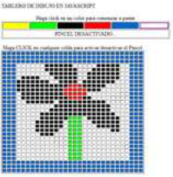

# 6. DOM erabilpena

## Ariketa

Marrazketa arbel bat simulatzen duen JavaScript aplikazio bat egin nahi dugu. Horretarako 30x30 neurriko taula bat marrazku beharko duzu, 10\*10 pixel zelula bakoitza.

Taula marrazteko ezinbestekoa da DOMean nodoak sortzeko teknikak erabiltzzea. Behin taula sortu ostean, _imagezone_ izeneko **DIV**-aren barruan jarri beharko duzu. Horrez gain 5 koloretako paleta (_palette_) bat izango duzu, aurretik sortua .html fitxategian.

HTML eta CSS fitxategi bat emango zaizkizu, orrian egitura eta estiloekin. Horretaz aparte, ariketarekin datorren JavaScript fitxategian programa osatu beharko duzu. Aplikazioa cross-browser izan beharko da, Firefox, Chrome eta Explorer 10-tik aurrerakoekin konpatiblea.

CSS fitxategian ezarritako koloreak aldatuz gero (colour1-6), aplikazioak ondo erantzun eta egoki funtzionatu beharko du:

    * Paletako 5 koloretako batetan klik egingo dugu eta *.selected* klasea jarriko zaio.
    * Behin kolorea ezarri ostean, zelula batetan klik egingo dugu (hautatutako kolorez margotuko dena) eta hortik aurrera saguarekin *hover* egiten diogun zelula guztiak kolore horretaz margotu beharko dira, beste zelula batetan klik egin arte.
    * Kolorez aldatu eta eragiketa errepikatu ala izango dugu, baita aurretik margoztuak izan diren zeldetan ere.
    * Zelda bat ezabatzeko, zuriz margotuko dugu.
    * Eskuila aktibatua dagoen bakoitzean, paletaren azpian mezu bat azalduko da: ESKUILA AKTIBATUA edo ESKUILA DESAKTIBATUA.

### Adibidea

## Ebaluazio irizpideak

Ariketak balio dituen 10 puntuak honela banatuta daude:

    * Ebentoen esleipenarako cross-browser funtzioa (1 p.).
    * DOM-aren metodoak erabiliz taula marraztu (2,5 p.).
    * Marrazkirako paletatik kolorea hautatu eta aktibo jarri (2 p.).
    * Eskuila aktibatu/desaktibatu (0,5 p.).
    * Margoztu (1 p.).
    * Ariketan aipatutako nabigatzaileekin konpatiblea izatea (2 p.).
    * Kodearen txukuntasuna (komentarioak, identazioa, ...) (1 p.).
